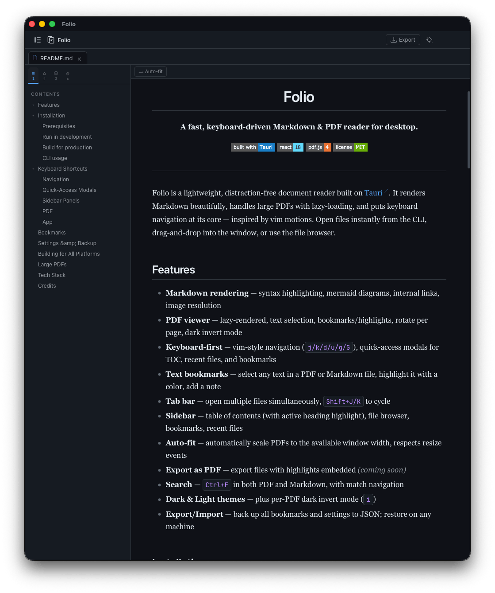
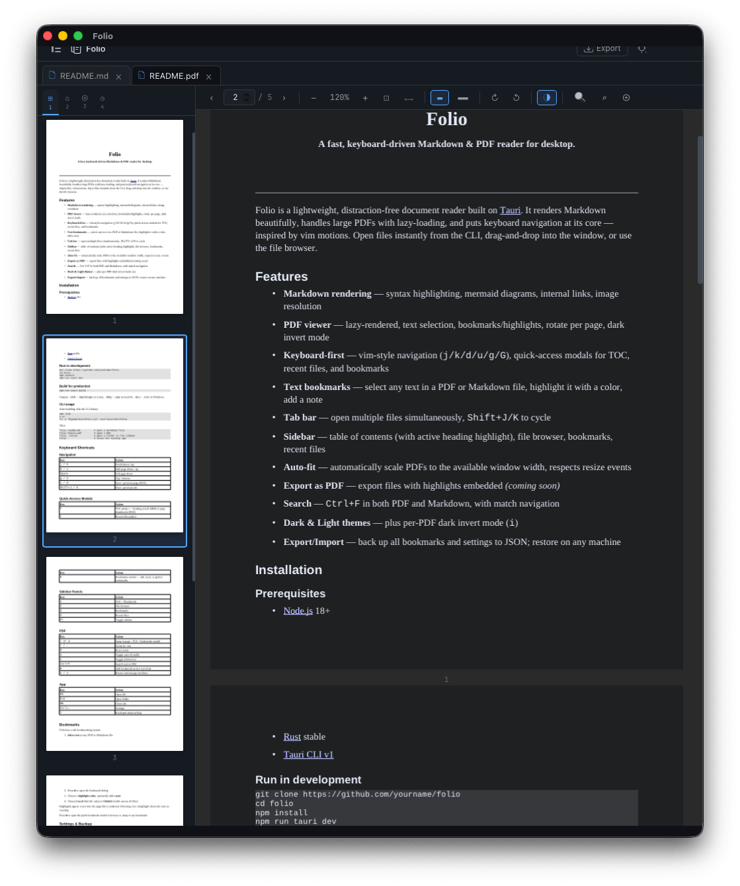

<div align="center">
  
  <h1>Folio</h1>
  <p><strong>A fast, keyboard-driven Markdown & PDF reader for desktop.</strong></p>
  <p>
    
    
    
    
  </p>
</div>

---

Folio is a lightweight, distraction-free document reader built on [Tauri](https://tauri.app). It renders Markdown beautifully, handles large PDFs with lazy-loading, and puts keyboard navigation at its core — inspired by vim motions. Open files instantly from the CLI, drag-and-drop into the window, or use the file browser.

## Features

- **Markdown rendering** — syntax highlighting, mermaid diagrams, internal links, image resolution
- **PDF viewer** — lazy-rendered, text selection, bookmarks/highlights, rotate per page, dark invert mode
- **Keyboard-first** — vim-style navigation (`j/k/d/u/g/G`), quick-access modals for TOC, recent files, and bookmarks
- **Text bookmarks** — select any text in a PDF or Markdown file, highlight it with a color, add a note
- **Tab bar** — open multiple files simultaneously, `Shift+J/K` to cycle
- **Sidebar** — table of contents (with active heading highlight), file browser, bookmarks, recent files
- **Auto-fit** — automatically scale PDFs to the available window width, respects resize events
- **Export as PDF** — export files with highlights embedded _(coming soon)_
- **Search** — `Ctrl+F or /` in both PDF and Markdown, with match navigation
- **Dark & Light themes** — plus per-PDF dark invert mode (`i`)

## Installation

- Directly Install from release page.

## Build

### Prerequisites

- [Node.js](https://nodejs.org) 18+
- [Rust](https://rustup.rs) stable
- [Tauri CLI v1](https://tauri.app/v1/guides/getting-started/prerequisites)

### Run in development

```bash
git clone https://github.com/wormcracker/folio
cd folio
npm install
npm run tauri dev
```

### Build for production

```bash
npm run tauri build
```

Outputs `.deb` / `.AppImage` on Linux, `.dmg` / `.app` on macOS, `.msi` / `.exe` on Windows.

### CLI usage

After building, link the CLI binary:

```bash
npm link
# or
ln -s "$(pwd)/bin/folio.cjs" /usr/local/bin/folio
```

Then:

```bash
folio readme.md          # open a markdown file
folio thesis.pdf         # open a PDF
folio ./notes            # open a folder in the sidebar
folio                    # focus the running app
```

## Keyboard Shortcuts

### Navigation

| Key           | Action                     |
| ------------- | -------------------------- |
| `j / k`       | Scroll down / up           |
| `d / u`       | Half page down / up        |
| `Space`       | Full page down             |
| `g / G`       | Top / bottom               |
| `n / N`       | Next / previous page (PDF) |
| `Shift+J / K` | Next / previous tab        |

### Quick-Access Modals

| Key | Action                                                    |
| --- | --------------------------------------------------------- |
| `f` | TOC picker — heading search (MD) or page thumbnails (PDF) |
| `r` | Recent files picker                                       |
| `b` | Bookmarks modal — add, local, or global bookmarks         |

### Sidebar Panels

| Key  | Action           |
| ---- | ---------------- |
| `1`  | TOC / Thumbnails |
| `2`  | File browser     |
| `3`  | Bookmarks        |
| `4`  | Recent files     |
| `⌘\` | Toggle sidebar   |

### PDF

| Key      | Action                               |
| -------- | ------------------------------------ |
| `/ or p` | Jump to page / TOC / bookmarks modal |
| `+ / -`  | Zoom in / out                        |
| `0`      | Reset zoom                           |
| `a`      | Toggle auto-fit width                |
| `i`      | Toggle dark invert                   |
| `Ctrl+F` | Search text in PDF                   |
| `m`      | Add bookmark (select text first)     |
| `↻ / ↺`  | Rotate current page (toolbar)        |

### App

| Key      | Action                 |
| -------- | ---------------------- |
| `⌘O`     | Open file              |
| `⌘⇧O`    | Open folder            |
| `⌘W`     | Close tab              |
| `Ctrl+,` | Settings               |
| `?`      | Keyboard shortcut help |

## Bookmarks

Folio has a rich bookmarking system:

1. **Select text** in any PDF or Markdown file
2. Press **`m`** to open the bookmark dialog
3. Choose a **highlight color**, optionally add a **note**
4. Choose **Local** (this file only) or **Global** (visible across all files)

Highlights appear every time the page/file is rendered. Hovering over a highlight shows the note as a tooltip.

Press **`b`** to open the quick bookmark modal to browse or jump to any bookmark.

## Settings & Backup

Open **Settings** (`Ctrl+,`) to configure:

- Theme, PDF defaults, highlight colors, auto-fit, page numbers
- **Export** — saves all bookmarks and settings to a timestamped `.json` file
- **Import** — restores from a Folio backup file (merges, no duplicates)

## Building for All Platforms

Use GitHub Actions to build for Linux, macOS, and Windows from one push:

```yaml
# .github/workflows/release.yml
- uses: tauri-apps/tauri-action@v0
  with:
    tagName: v${{ github.ref_name }}
    releaseName: "Folio v__VERSION__"
  env:
    GITHUB_TOKEN: ${{ secrets.GITHUB_TOKEN }}
```

For local cross-compilation to Windows from Linux:

```bash
rustup target add x86_64-pc-windows-gnu
cargo tauri build --target x86_64-pc-windows-gnu
```

## Large PDFs

Folio handles large PDFs through:

- **Lazy rendering** — pages are only rendered when they scroll into the viewport (plus 400px ahead)
- **IntersectionObserver** — triggers render only for visible pages
- **ResizeObserver** — recalculates auto-fit scale on window resize
- **Rendering lock** — prevents double-rendering the same page simultaneously

## Tech Stack

| Layer    | Tech                                           |
| -------- | ---------------------------------------------- |
| Shell    | [Tauri v1](https://tauri.app) + Rust           |
| UI       | React 18 + TypeScript                          |
| State    | Zustand (persisted)                            |
| PDF      | [pdf.js 4](https://mozilla.github.io/pdf.js/)  |
| Markdown | [marked](https://marked.js.org) + highlight.js |
| Bundler  | Vite                                           |

## ScreenShots

<p align="center">
  
  
</p>

## Credits

Created with ❤️ using [Tauri](https://tauri.app), [pdf.js](https://mozilla.github.io/pdf.js/), [React](https://react.dev), and [marked](https://marked.js.org).

---

Built by [wormcracker(sushant)](https://github.com/wormcracker).

MIT License
